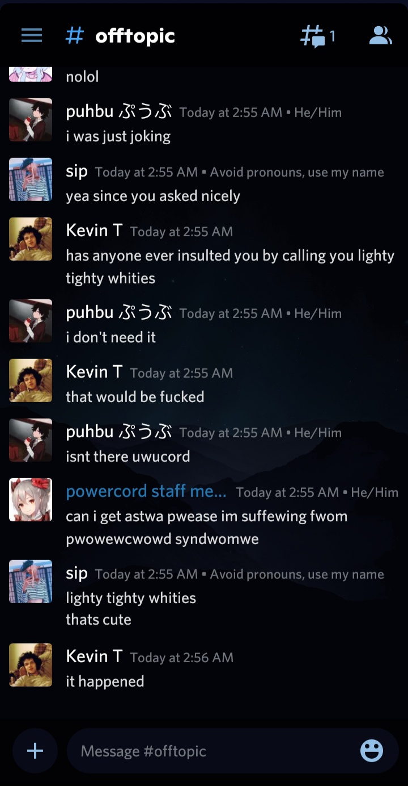

## aliuwucord

### `Cherry v2.6`

Port of nullxception's [VSCode](https://github.com/nullxception/cherry-vscode)/[KDE themes](https://github.com/nullxception/cherry-kde-theme), this is a theme for [Aliucord](https://github.com/aliucord) that doesn't suck shit.

Pay nullxception's themes a visit if you like this.

> Clean, Flat, Fervent Tempo battlesuit-inspired Theme for Aliucord.

#### Preview:
>  

>    
>  
 

## Issues:  

- None.

<h1></h1>

### `Crystal v1.0`

Blueish theme with purpleish accents, aimed to give you a true discord experience.

#### Preview:
> 

>   
> 

<h1></h1>

### `Dispersion v1.0`

Cozy theme that doesn't bleed your eyes.

#### Preview:
> 

>   
> 

