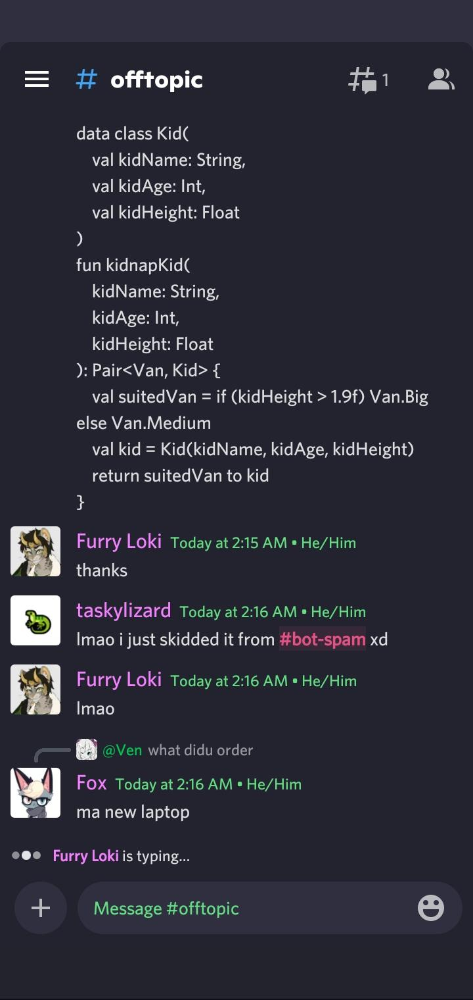

## aliuwucord

### `Cherry v2.0`

Port of nullxception's [VSCode](https://github.com/nullxception/cherry-vscode)/[KDE themes](https://github.com/nullxception/cherry-kde-theme), this is a theme for [Aliucord](https://github.com/aliucord) that doesn't suck shit.

Pay nullxception's themes a visit if you like this.

> Clean, Flat, Fervent Tempo battlesuit-inspired Theme for Aliucord.

#### Preview:
>  

>    
>    <em style="color: grey">Your usual epic chat.</em>
>  
 

## Issues:  
None that i can think of, this seems pretty complete, unless i want to theme some parts up.

